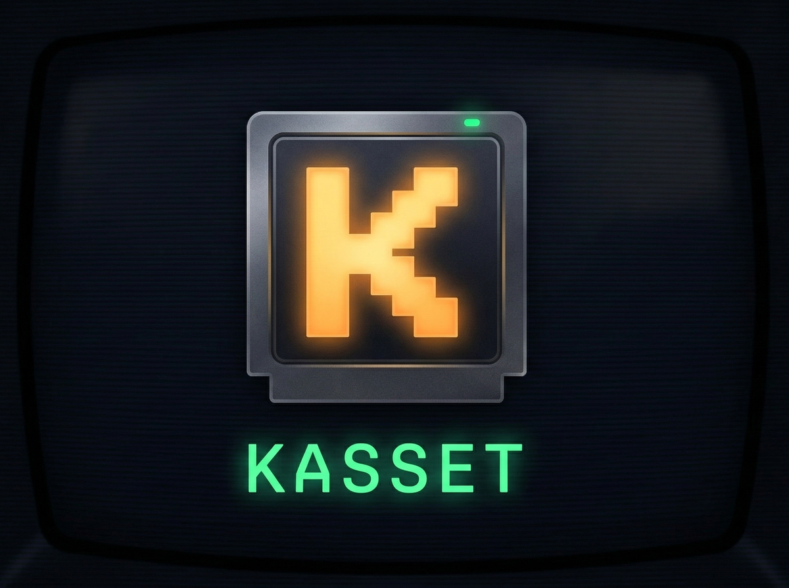

<p align="center">
  
</p>

<p align="center">
  <strong>A local AI assistant for Mac with swappable agent kassets, tool calling, and streaming — powered by Qwen 3.5 on Apple Silicon.</strong>
</p>

<p align="center">
  Fully private, multimodal AI on your Mac. No cloud, no API keys, no data leaves your machine.
</p>

<p align="center">
  <a href="#quick-start">Quick Start</a> · <a href="#built-in-kassets">Kassets</a> · <a href="#kasset-forge">Forge</a> · <a href="#network-access">Network</a> · <a href="#api-reference">API</a>
</p>

---

## Features

- **Kasset System** — swap between 10 specialized agents with stacking constraint enforcement (conflicts, requirements)
- **Image Editor** — natural-language image editing with 18 built-in helpers (adjust, crop, hue shift, blur, draw, threshold, etc.) and cross-turn image persistence
- **Kasset Forge** — create your own kassets and custom tools through an in-app GUI studio
- **Tool Plugin System** — extend the agent with custom Python tools (3D charts, audio, web artifacts, anything)
- **Vision** — paste images, solve problems from screenshots, describe photos
- **Streaming** — real-time token streaming with thinking/reasoning display and live code preview during tool calls
- **Tool Calling** — file access, shell commands, Python sandbox, web search, C++ execution, and user plugins
- **HTML Artifacts** — custom tools can return interactive HTML rendered inline (Plotly, web apps, visualizations)
- **Network Access** — access Kasset from your phone/tablet on the same Wi-Fi, with password-protected authentication
- **Smart Continuation** — auto-detects when model output is truncated and seamlessly continues the response
- **Context Management** — session summaries with trim notifications, per-kasset memory, global user profile, async post-conversation processing
- **Inline Attachments** — attach files/directories as inline chips in your messages
- **Visualization** — matplotlib plots auto-captured, built-in `qchart_*` helpers, Plotly 3D support
- **Persistent Memory** — learns your preferences across conversations
- **LaTeX & Code** — renders math equations and syntax-highlighted code blocks

## Quick Start

> **Requirements:** macOS with Apple Silicon (M1+), Python 3.10+, Node.js 18+, ~6 GB RAM free

```bash
git clone https://github.com/darkwebber/Kasset.git
cd Kasset
chmod +x start.sh
./start.sh
```

That's it. `start.sh` handles everything:

1. Validates Python 3.10+, Node.js 18+, npm, and port availability
2. Creates a Python virtual environment (first run only)
3. Installs all backend and frontend dependencies
4. Creates user data directories at `~/.kasset/`
5. Starts the FastAPI backend (port 7861) and Next.js frontend (port 3000)
6. Detects your LAN IP and displays a network URL for mobile access

Open **http://localhost:3000** and press **Ctrl+C** to stop both servers.

> **First run?** The model (~5 GB) downloads automatically from Hugging Face. Subsequent starts take ~10 seconds.

## Built-in Kassets

| Kasset | Icon | Tools | Purpose |
|--------|------|-------|---------|
| General Assistant | 🤖 | All | Default all-purpose helper |
| Code Pilot | 🚀 | Python, C++, file, shell | Pair programming, debugging, code review |
| Tutor | 🎓 | Python, search, file | Teaching with examples and analogies |
| Data Analyst | 📊 | Python, file, search | Data analysis, statistics, visualization |
| Terminal | 💻 | Shell, file, system | Natural language shell interface |
| Writer | ✍️ | File, search, web | Creative and technical writing |
| DevOps | 🔧 | Shell, file, search | Git, Docker, CI/CD, infrastructure |
| Web Pilot | 🌐 | Search, web, file | Web research and information synthesis |
| 3D Visualizer | 🧊 | Python | Interactive 3D visualizations with Plotly |
| Image Editor | 🎨 | Python, file, search | Natural-language image manipulation |

## Built-in Tools

| Tool | Description |
|------|-------------|
| `get_current_time` | Current date and time |
| `list_directory` | Browse files with sizes |
| `get_system_info` | OS, hardware, disk, uptime |
| `search_files` | Glob-based recursive file search |
| `read_file` | Read text files — under 50 KB shown fully, over 50 KB returns structural overview (imports, signatures, exports). Max 500 KB |
| `run_command` | Shell commands with consent flow for write operations and process management |
| `calculate` | Safe math evaluator (sqrt, trig, factorial, etc.) |
| `execute_python` | Stateful Python sandbox with pandas, numpy, matplotlib, scipy, seaborn, scikit-learn, Plotly, PIL |
| `execute_cpp` | Compile and run C++ code (C++17) |
| `search_web` | DuckDuckGo web search |
| `read_url` | Fetch and extract text from web pages — ads, navs, and boilerplate auto-stripped |
| `read_rss` | Read RSS/Atom feeds — returns structured entries with title, date, link, summary |
| `get_location` | IP-based geolocation — city, region, country, timezone, coordinates |

## Image Editing

The **Image Editor** kasset provides 18 Python helpers available inside `execute_python`:

| Helper | Description |
|--------|-------------|
| `img_load(path)` | Load image → PIL Image |
| `img_save(img, path)` | Save to file (auto-names if no path) |
| `img_show(img)` | Display inline + auto-save for cross-turn persistence |
| `img_info(img)` | Size, mode, format metadata |
| `img_adjust(img, brightness, contrast, saturation, sharpness)` | Level adjustments (1.0 = unchanged) |
| `img_hue_shift(img, degrees)` | Shift hue (0–360) |
| `img_grayscale(img)` | Convert to grayscale |
| `img_color_replace(img, from_rgb, to_rgb, tolerance)` | Replace one color with another |
| `img_crop(img, l, t, r, b)` | Crop to rectangle |
| `img_resize(img, w, h?)` | Resize (aspect-preserving if no height) |
| `img_rotate(img, degrees)` | Rotate counter-clockwise |
| `img_flip(img, direction)` | Flip horizontal or vertical |
| `img_blur(img, radius)` | Gaussian blur |
| `img_edge_detect(img)` | Edge detection filter |
| `img_threshold(img, value)` | Binary threshold segmentation |
| `img_draw_rect(img, l, t, r, b, color, width)` | Draw rectangle overlay |
| `img_draw_text(img, x, y, text, color, size)` | Draw text overlay |
| `img_convert(img, mode)` | Convert color mode (RGB, RGBA, L, etc.) |

Images persist across conversation turns — say "add green tint" then "now make it warmer" and the agent continues editing the same image.

## Vision & Image Processing

Attach images via paste (Ctrl/Cmd+V), file picker, or drag-and-drop. The pipeline:

1. **Upload** — saved to `~/.kasset/uploads/`, validated (extension, size ≤ 10 MB, path sandboxing)
2. **EXIF auto-rotation** — phone photos corrected for orientation
3. **RGBA flattening** — transparent PNGs composited onto white for VLM compatibility
4. **Adaptive resize** — images exceeding 768 px downscaled with LANCZOS to prevent OOM
5. **Template switching** — VLM's original chat template restored for vision inference
6. **Vision on first round** — image passed to model on initial generation; subsequent tool rounds retain understanding
7. **Temp file cleanup** — resized images cleaned up after each turn

Supported: `.jpg` `.jpeg` `.png` `.gif` `.bmp` `.webp` `.tiff`

## Network Access

Kasset binds to `0.0.0.0` so any device on your local network can connect. On first network access:

1. **Local setup** — visit Kasset on your Mac and set a network password
2. **Remote login** — open the Network URL (shown in terminal) on your phone/tablet and enter the password
3. **Safety** — network clients can chat and upload files, but **cannot** execute shell commands, run code, or browse the host filesystem

Authentication uses scrypt password hashing with session tokens and a 3-strike lockout per IP.

## Context Management

Three layers of context, each toggleable in the **Context** tab:

- **Session Summary** — when conversations get long, older messages are intelligently summarized to free context space
- **Kasset Context** — remembers topics and patterns from previous chats with the same kasset
- **Global Profile** — app-wide understanding of you across all kassets (usage patterns, languages, preferences)

## Kasset Forge

Open **Kasset Forge** from the kasset carousel or the wrench icon in the top bar.

### Creating a Kasset

1. **Kassets** tab → **New Kasset**
2. Fill in name, description, system prompt, and select tools
3. Customize theme colors and boot animation
4. **Save** — appears in the carousel immediately

### Creating a Custom Tool

1. **Tools** tab → **New Tool**
2. Define name, description (what the model sees), and parameters
3. Choose output type: `text`, `html`, `image`, or `mixed`
4. Write the handler in Python
5. **Test** to verify, then **Save**

The tool is instantly available to assign to any kasset.

## Tool Plugin Standard

Each custom tool lives in `~/.kasset/tools/<tool-id>/` with two files:

### `manifest.json`

```json
{
  "id": "plotly_3d",
  "name": "Plotly 3D Chart",
  "version": "1.0.0",
  "description": "Create interactive 3D visualizations using Plotly",
  "author": "user",
  "icon": "cube",
  "color": "#636efa",
  "parameters": {
    "code": {
      "type": "string",
      "description": "Python code using plotly to create 3D visualizations",
      "required": true
    }
  },
  "output_type": "html",
  "handler": "handler.py",
  "entry_point": "execute",
  "sandbox": {
    "timeout": 30,
    "imports": ["plotly"],
    "pre_run": "import plotly.graph_objects as go"
  }
}
```

### `handler.py`

```python
def execute(code: str) -> dict:
    """Entry point called by the agent. Return types:
        str  -> displayed as text
        dict -> { "output": str, "images": [base64], "html": str }
    """
    import plotly.graph_objects as go
    # ... execute user code, capture figure ...
    return {
        "output": "3D chart created",
        "html": fig.to_html(include_plotlyjs=True)
    }
```

### Output Types

| Type | Return | Frontend Rendering |
|------|--------|--------------------|
| `text` | `str` | Plain text in tool result |
| `html` | `dict` with `html` key | Sandboxed iframe artifact |
| `image` | `dict` with `images` key (base64) | Inline images |
| `mixed` | `dict` with any combination | All applicable renderers |

## Project Structure

```
Kasset/
├── backend/                       # Python FastAPI backend
│   ├── api.py                     # REST + SSE + Forge endpoints
│   ├── model_server.py            # MLX-VLM model wrapper
│   ├── utils.py                   # Image validation
│   └── core/
│       ├── agent.py               # Agent orchestration & tool loop
│       ├── cartridge_loader.py    # Kasset loading, stacking & CRUD
│       ├── context_manager.py     # Multi-layer context management
│       ├── persistence.py         # Chat storage & user memory
│       ├── network_auth.py        # Network auth (scrypt + sessions)
│       ├── plugin_loader.py       # Custom tool plugin discovery
│       ├── sandbox.py             # Python sandbox + image helpers
│       └── tool_registry.py       # Built-in tools + plugin dispatch
├── frontend/                      # Next.js React frontend
│   └── src/
│       ├── components/
│       │   ├── Console.tsx            # Main chat UI
│       │   ├── CartridgeCarousel.tsx   # Kasset selector
│       │   ├── ChatDrawer.tsx         # Chat history sidebar
│       │   ├── NetworkAuthModal.tsx    # Network login UI
│       │   ├── Tutorial.tsx           # Onboarding guide
│       │   └── studio/
│       │       └── ForgeStudio.tsx     # Kasset & tool creator
│       ├── stores/                # Zustand state management
│       └── lib/
│           └── api.ts             # Dynamic API base (local/network)
├── cartridges/
│   ├── builtins/                  # 10 built-in kasset definitions
│   └── schema.json                # Kasset JSON schema
├── branding/                      # Logo and favicon
├── start.sh                       # One-command launcher
└── README.md
```

## User Data

All user data is stored at `~/.kasset/` (never in the repo):

```
~/.kasset/
├── cartridges/              # User-created kassets (JSON)
├── tools/                   # User-created tool plugins
│   └── <tool-id>/
│       ├── manifest.json    # Tool metadata & parameter schema
│       └── handler.py       # Python implementation
├── chats/                   # Saved conversations
├── context/
│   ├── global_profile.json  # App-wide user understanding
│   └── cartridges/          # Per-kasset context
├── workspace/               # Sandbox working directory & edited images
├── cache/                   # Summary cache
├── uploads/                 # Pasted/uploaded files
├── user_memory.json         # Learned user preferences
├── settings.json            # User toggles
└── network_auth.json        # Network password & sessions
```

## Architecture

```
┌─────────────────────────────┐          ┌─────────────────────────────┐
│  Next.js Frontend (:3000)   │──HTTP──▶│  FastAPI Backend (:7861)     │
│                             │◀──SSE───│                             │
│  CartridgeCarousel          │          │  Agent (tool loop)          │
│  Console (chat + segments)  │          │  MLX-VLM (Qwen 3.5)        │
│  ForgeStudio (CRUD)         │          │  Tool Registry + Plugins    │
│  NetworkAuthModal           │          │  Python Sandbox + img_*     │
│  ChatDrawer (history)       │          │  Context Manager            │
│  Zustand stores             │          │  Network Auth (scrypt)      │
└─────────────────────────────┘          └──────────────┬──────────────┘
                                                        │
      📱 Phone/Tablet ──────── Wi-Fi ──────────────────┘
      (password-protected, no code execution)

      ~/.kasset/   ← all user data, kassets, tools, chats, memory
```

## Security Model

- **Sandbox hardening** — `exec()`, `eval()`, `compile()`, `__import__()`, and builtins bypass tricks are blocked in the Python sandbox
- **Plugin safety** — tool handler paths validated against directory traversal; all dynamic values (handler path, entry point, pre_run) passed via JSON stdin instead of string interpolation to prevent code injection
- **CORS restriction** — origins restricted to `localhost`, `127.0.0.1`, and private LAN ranges (no wildcard `*`)
- **Request size limits** — POST/PUT bodies capped at 10 MB to prevent abuse
- **Rate limiting** — `/api/chat` endpoint rate-limited to 10 requests per 60 seconds per IP
- **Inference lock** — concurrent model requests are serialized via threading lock to prevent corruption
- **Atomic writes** — all JSON persistence uses `fcntl` file locking + write-to-temp-then-rename to prevent data corruption from concurrent access
- **Blocklist + Consent** — destructive commands (`rm`, `sudo`) are blocked; process management (`kill`, `killall`, `pkill`) and write operations (`mkdir`, `cp`, `git commit`, `pip install`) require user approval via in-chat consent UI
- **Shell chaining** — `&&`, `;`, `||` supported; each sub-command validated individually
- **Pipes** — `cmd1 | cmd2 | cmd3` supported; each stage validated
- **Path sandboxing** — file access restricted to home directory and temp folders
- **Timeouts** — all commands have a 30-second timeout
- **Output limits** — command output capped at 8000 characters
- **Plugin isolation** — custom tool handlers run in isolated subprocesses with stdout capture; errors caught and reported
- **Network safety** — remote clients cannot execute code, shell commands, or browse the filesystem
- **Auth** — scrypt password hashing, session tokens via `secrets.token_urlsafe(48)`, 3-strike lockout per IP
- **Secure IDs** — chat IDs generated with `secrets.token_hex()` instead of predictable timestamps

## API Reference

### Core

| Endpoint | Method | Description |
|----------|--------|-------------|
| `/api/chat` | POST | SSE streaming chat with tool execution |
| `/api/kassets` | GET | List all kassets (builtin + user) |
| `/api/kassets/load` | POST | Load merged config for a kasset stack |

### Chat Persistence

| Endpoint | Method | Description |
|----------|--------|-------------|
| `/api/chats` | GET | List all saved conversations |
| `/api/chats/{id}` | GET | Load a conversation |
| `/api/chats/{id}/save` | POST | Save/update a conversation |
| `/api/chats/{id}` | DELETE | Delete a conversation |

### User Memory & Context

| Endpoint | Method | Description |
|----------|--------|-------------|
| `/api/memory` | GET | Get all user memories |
| `/api/memory` | POST | Add a memory |
| `/api/memory/{id}` | PUT | Update a memory |
| `/api/memory/{id}` | DELETE | Delete a memory |
| `/api/settings` | GET | Get user settings |
| `/api/settings/{section}` | PUT | Update a settings section |
| `/api/context/kasset/{id}` | GET | Get persistent kasset context |
| `/api/context/kasset/{id}` | DELETE | Clear kasset context |
| `/api/context/global` | GET | Get global user profile |
| `/api/context/global` | DELETE | Clear global profile |
| `/api/rss-feeds` | GET | Get configured RSS feeds |
| `/api/rss-feeds` | PUT | Replace all RSS feeds |
| `/api/rss-feeds` | POST | Add a single RSS feed |
| `/api/rss-feeds/{index}` | DELETE | Delete an RSS feed by index |

### Kasset Forge

| Endpoint | Method | Description |
|----------|--------|-------------|
| `/api/forge/tools` | GET | List all tools (builtin + user) |
| `/api/forge/tools/{id}` | GET | Get tool manifest + handler code |
| `/api/forge/tools` | POST | Create/update a tool plugin |
| `/api/forge/tools/{id}` | DELETE | Delete a user tool |
| `/api/forge/tools/test` | POST | Test-execute a tool |
| `/api/forge/kassets/{id}` | GET | Get kasset JSON for editing |
| `/api/forge/kassets` | POST | Create/update a user kasset |
| `/api/forge/kassets/{id}` | DELETE | Delete a user kasset |
| `/api/forge/all-tool-ids` | GET | All tool IDs for kasset editor |
| `/api/forge/tool-meta` | GET | Frontend rendering metadata |

### Authentication

| Endpoint | Method | Description |
|----------|--------|-------------|
| `/api/auth/status` | GET | Check auth config + client type |
| `/api/auth/setup` | POST | Set network password (local only) |
| `/api/auth/login` | POST | Authenticate a network client |
| `/api/auth/logout` | POST | Revoke session |

### Filesystem

| Endpoint | Method | Description |
|----------|--------|-------------|
| `/api/fs/list` | POST | List directory (local clients only) |
| `/api/fs/read-image` | GET | Serve image for inline preview |
| `/api/fs/upload` | POST | Upload a file to `~/.kasset/uploads/` |
| `/api/tool/consent` | POST | Approve/deny a command |
| `/api/tool/run-approved` | POST | Execute an approved command |

## Troubleshooting

**Python not found?**
```bash
brew install python@3.12
```

**Node.js not found?**
```bash
brew install node
```

**Port in use?**
```bash
lsof -i :7861 -i :3000 -t | xargs kill -9
```

**Backend crashes on start?**
```bash
source venv/bin/activate
python -m uvicorn backend.api:app --log-level debug
```

**Model download stalled?**
```bash
# Delete partial download and retry
rm -rf ~/.cache/huggingface/hub/models--Qwen*
./start.sh
```

**Frontend not loading?**
```bash
cd frontend && rm -rf node_modules .next && npm install
```

**Network access not working?**
- Ensure both devices are on the same Wi-Fi network
- Check that your firewall allows incoming connections on ports 3000 and 7861
- Set a network password first from the local machine

## License

MIT. Use it however you like.
